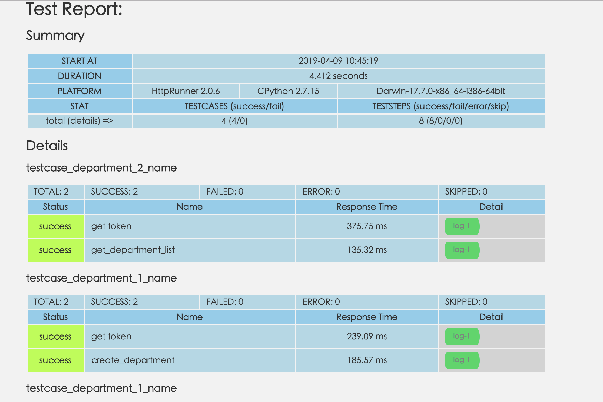

# 简介
使用httprunner框架做企业微信接口测试


# 项目结构

v1
  api:公共函数
  
  config:配置文件
  
  reports:报告
  
  testcases:测试用例
  
  testsuites:测试套件(参数化)
   
   
v2
  .....
  

# 测试用例

eg:
```angularjs
- config: (用例中公共配置)
      name: test_department
      request:
          base_url: ''
          verify: false
      headers:
          User-Agent: 'Apache-HttpClient/4.5.3 (Java/1.8.0_161)'
      variables:
          - get_token_api: ${get_token_url()}
          - cord_id: ${get_cord_id()}
          - corpsecret: ${get_secure()}
          - get_list_api: "https://qyapi.weixin.qq.com/cgi-bin/department/list?access_token="
          - create_api: "https://qyapi.weixin.qq.com/cgi-bin/department/create?access_token="
          - del_api: "https://qyapi.weixin.qq.com/cgi-bin/department/delete?access_token="

- test:(测试用例)
      name: get token
      api: get_login_token($get_token_api,$cord_id,$corpsecret)
      extract:
          - access_token: content.access_token

- test:
    name: get_department_list
    request:
      method:  GET
      url:  $get_list_api$access_token
    validate:
        - eq: ["status_code", 200]
        - eq: ["content.errcode", 0]
```  
  
# 参数化

## 硬编码

## csv

## debugtalk
  
 
# hook函数

## setup_hooks

## teardown_hooks


# 断言

## 


# 执行
```
hrun v1/testsuites/
```

# 报告



# 学习贴

https://cn.httprunner.org 